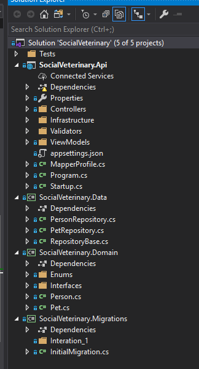

# Overview
This is a web application for social veterinary surgeons where they can manage customers and their pets.

# Technologies & Tools
+ Angular 8 with TypeScript
+ .Net Core 3.0
+ MySQL database
+ FluentMigrator
+ Docker
+ Dapper
+ Swagger
+ Automapper
+ FluentValidator
+ xUnit, Moq

# Project structure
### Backend

The solution is devided into several projects for covenient development and maintenance:
+ **SocialVeterinary.Api** (Presentation layer) - Asp.net core application that provides api for website
+ **SocialVeterinary.Domain** (Business layer) - library that contains domain entities and business logic
+ **SocialVeterinary.Data** (Data access layer) - library with classes for manipulating with data storage
+ **SocialVeterinary.Migrations** - library with database migration scripts



### Fronend
Frontend components are organized according to nesting levels, shared components and classes are located in a separate **shared** folder.

An additional layer of services was added to assemble logic for working with backend. Such code structure makes code more readable and maintanable.


# Database migrations
For database migrations, I used [Fluent Migrator](https://fluentmigrator.github.io/) which is great alternative to creating lots of sql scripts that have to be run manually by every developer involved.

Fluent migrator scripts are database agnostic which provide us an ability to switch to another supported databases if needed (like MS SQL server, Postgresql etc)

# Testing
The solution contains examples of unit and integration tests. For test method naming the **MethodName_StateUnderTest_ExpectedBehavior** pattern is used.

+ Unit tests - SocialVeterinary.Api.Unittests project

+ Integration tests - SocialVeterinary.Data.IntegrationTests project

+ E2e tests - N/A

# Deployment
Api and website projects have their own Dockerfile files that can be used to create a docker image. The docker images can be hosted in any environment that supports Docker.

# Documentation

## User Features
According an initiat requirements, the application provides functionality where surgeons can manage their customers and pets.

### View list of people
Page where user can see a list of all customers with information about their pets.


### View person details & pets
Page where user can see details for a specific customer with a list of pets. In addition, it's possible to add a new pet for customer on this page.


### Add a new person to people list
Page where user can create a new customer.


## API
[Swagger](https://swagger.io/) tool is used for api documentation. It provides UI where developers can see all available web methods, their description and even run queries against api.

For local environment, you can access it by the following link: http://localhost:8089/api/swagger/index.html


# How to run on local environment
Prerequisites:
+ Docker

To run application locally, all you need is to run docker-compose file. It will build images for the following parts:
- **Frontend** (build all assets and run nginx to serve them)
- **Backend** (build api image and run it in docker container)
- **Database** (run mysql instance using image from Docker Hub)
- **Database migrations** (run migrations for the database and initialize the database schema)

Steps:
+ Clone git repository to your local environemt
+ Go to **devops** folder and run the following command:
```
docker-compose -f docker-compose.yml up
```


